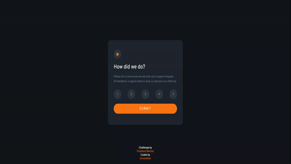

# Interactive rating component

"This is an app that asks you to rate a service, allows you to add a score from 1 to 5, and allows you to send said rating, returning a thank you on the screen."

### Feature of the app

- Mobile-friendly responsive interface.

- Modern design with Flexbox CSS.


---

## Project Demostration



---

### I used to complete this app rating this technologies

" This project was developed with HTML, CSS, and Javascript "


### Live Demo Project [here]()

### Try it

If you want to try this app

1- clone de repo

```bash
git clone https://github.com/Arirockdev/interactive-rating-commponent.git
```

2- open the `index.html` file in your browser 


## For the app I used:

- HTML

- CSS: flexbox

- Javascript


---


This project belongs to the following [Frontend Mentor]() challengue. You can check it  [here](https://my-interactive-rating-component-main.netlify.app/).


